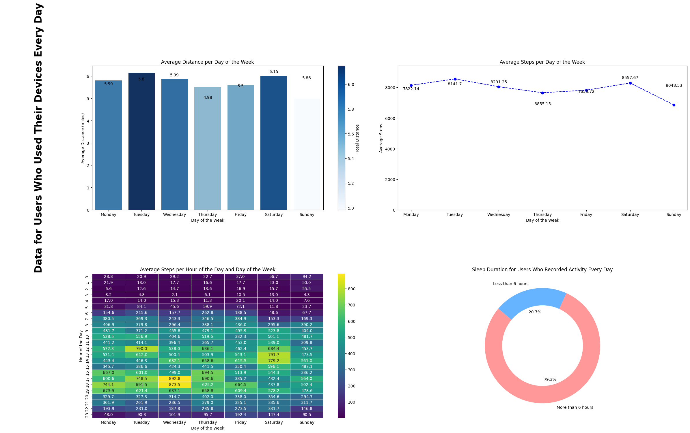

# Fitbit Fitness Data Tracker

[](https://github.com/afbeltranr/ml-fitibit-fitness-tracker/actions/workflows/python-app.yml)

## Project Description

This project is focused on exploring and analyzing the Fitbit fitness dataset. The primary goal is to perform exploratory data analysis (EDA) to uncover insights and patterns within the data. The project leverages Docker for containerization and continuous integration (CI) to ensure a smooth and automated workflow. The process of connecting to the Kaggle API to download the dataset is also automated, making it easy to replicate the project in different environments.

A detailed story of the data handling phase using python is shown in the [ jupyter notebook  ](/notebooks/ExploratoryDataAnalysis.ipynb)

## Features

- **Exploratory Data Analysis (EDA)**: Analyze the Fitbit dataset to uncover insights and patterns.
- **Docker and Containers**: Use Docker to containerize the application, ensuring consistency across different environments.
- **Continuous Integration (CI)**: Implement CI using GitHub Actions to automate testing and deployment.

## Requirements

- Python 3.9+
- Docker
- Kaggle API credentials

## Results 



## Analysis of Trends in Smart Device Usage and Marketing Implications

Based on the trends observed in the smart device usage data, several insights can be drawn to inform the company’s understanding of its customers and influence its marketing strategy.

### Key Trends
Out of 33 users, 21 individuals consistently used their smart devices every day, with peak activity occurring at specific times:
- **Tuesdays at 12:00 PM**
- **Wednesdays between 5:00 PM and 7:00 PM**
- **Saturdays between 1:00 PM and 3:00 PM**

This suggests that the users follow structured schedules, balancing their fitness routines around work and leisure. These time-specific trends align with the broader pattern in the fitness tracker industry, where wearables are commonly used during lunchtime workouts and evening sessions. According to a report from **Statista**, **28% of wearable device users** report exercising more regularly after using fitness trackers, indicating that these devices are powerful motivators for maintaining an active lifestyle ([Statista, 2023](https://www.statista.com/statistics/794849/wearable-device-exercise-more/)).

Additionally, among the 21 everyday users, **20.7% slept less than 6 hours per night**, while the majority slept more than 6 hours. This suggests that a significant portion of users may benefit from better sleep tracking features and education about the importance of rest. According to **Business Insider**, nearly **40% of wearable device users** consider sleep tracking as one of the most important features of their devices ([Business Insider, 2023](https://www.businessinsider.com/sleep-tracking-in-wearable-tech-market-growth-2019-11)).

### Application to the Company’s Customers
These insights suggest that a significant portion of the company’s customer base is already committed to tracking their fitness routines. The peak activity times—lunchtime on Tuesdays and afternoons on Saturdays—highlight opportunities for the company to develop personalized features or fitness plans that align with these schedules. 

For example, users who frequently engage in workouts during lunch breaks or early evening could benefit from **personalized workout suggestions**, reminders, or performance-optimizing features that integrate into their specific routines. These insights align with a trend reported by **Mordor Intelligence**, which highlights the growing role of wearable technology in personalizing fitness experiences, enabling users to optimize workouts based on their habits ([Mordor Intelligence, 2023](https://www.mordorintelligence.com/industry-reports/wearable-fitness-technology-market)).

In addition, the sleep tracking data highlights an opportunity for the company to address the needs of users who are not getting sufficient sleep. Offering features or content related to **sleep hygiene**, **recovery tips**, or even specialized sleep accessories could appeal to a health-conscious segment looking to improve overall wellness.

### Influence on Marketing Strategy
To capitalize on these findings, the company should refine its marketing strategy by segmenting its users based on their activity and sleep patterns. For example:
- **Active users** could be targeted with marketing that emphasizes performance optimization during peak hours. Tailored campaigns might focus on features like real-time feedback, advanced heart rate monitoring, or personalized fitness insights that enhance workout efficiency on high-activity days (e.g., Tuesdays and Saturdays).
- **Users with insufficient sleep** could be targeted with campaigns promoting sleep tracking features, recovery tools, and educational content on the importance of rest. Additionally, the company could consider partnerships with health apps or products that emphasize sleep improvement.

By segmenting users and tailoring marketing messages to their specific needs and habits, the company can position itself not only as a fitness tracker brand but as a comprehensive **health and wellness partner**. This approach aligns with industry-wide shifts where wearable tech is increasingly being used for holistic health management, not just fitness tracking. According to **Allied Market Research**, the global **fitness electronics market** is expected to grow at a compound annual growth rate (CAGR) of **19.6%** from 2020 to 2027, driven by the integration of new features like sleep monitoring and personalized insights ([Allied Market Research, 2023](https://www.alliedmarketresearch.com/fitness-tracker-market-A11348)).

By leveraging these trends, the company can position itself to capture a larger share of the growing market, increasing user engagement and retention while fostering long-term brand loyalty.

---

**References:**
1. [Statista, 2023](https://www.statista.com/statistics/794849/wearable-device-exercise-more/)
2. [Business Insider, 2023](https://www.businessinsider.com/sleep-tracking-in-wearable-tech-market-growth-2019-11)
3. [Mordor Intelligence, 2023](https://www.mordorintelligence.com/industry-reports/wearable-fitness-technology-market)
4. [Allied Market Research, 2023](https://www.alliedmarketresearch.com/fitness-tracker-market-A11348)


## Setup

1. **Clone the repository**:
   ```bash
   git clone https://github.com/afbeltranr/ml-fitibit-fitness-tracker.git
   cd ml-fitibit-fitness-tracker
